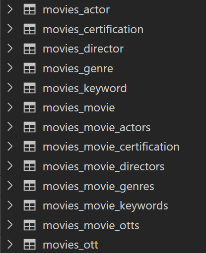
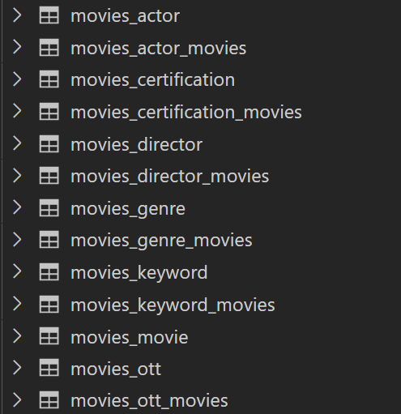

# First

```python
from django.db import models


class Genre(models.Model):
    name = models.CharField(max_length=50)


class Keyword(models.Model):
    name = models.CharField(max_length=50)


class Certification(models.Model):
    name = models.CharField(max_length=50)


class Actor(models.Model):
    name = models.CharField(max_length=50)


class Director(models.Model):
    name = models.CharField(max_length=50)


class OTT(models.Model):
    name = models.CharField(max_length=50)


class Movie(models.Model):
    title = models.CharField(max_length=100)
    orginal_title = models.CharField(max_length=100)
    overview = models.TextField()
    poster_path = models.CharField(max_length=200)
    release_date = models.DateField()
    certification = models.ManyToManyField(Certification, related_name='movies')
    runtime = models.IntegerField()
    genres = models.ManyToManyField(Genre, related_name='movies')
    keywords = models.ManyToManyField(Keyword, related_name='movies')
    actors = models.ManyToManyField(Actor, related_name='movies')
    directors = models.ManyToManyField(Director, related_name='movies')
    otts =  models.ManyToManyField(OTT, related_name='movies')
    video = models.CharField(max_length=100)
    vote_average = models.FloatField()
    vote_count = models.IntegerField()

```




# Changed

```python
from django.db import models

class Movie(models.Model):
    title = models.CharField(max_length=100)
    orginal_title = models.CharField(max_length=100)
    overview = models.TextField()
    poster_path = models.CharField(max_length=200)
    release_date = models.DateTimeField()
    runtime = models.IntegerField()
    video = models.CharField(max_length=100)
    vote_average = models.FloatField()
    vote_count = models.IntegerField()

class Genre(models.Model):
    name = models.CharField(max_length=50)
    movies = models.ManyToManyField(Movie, related_name='genres')

class Certification(models.Model):
    name = models.CharField(max_length=50)
    movies = models.ManyToManyField(Movie, related_name='certifications')

class Actor(models.Model):
    name = models.CharField(max_length=50)
    profile_path = models.CharField(max_length=200)
    movies = models.ManyToManyField(Movie, related_name='actors')

class Director(models.Model):
    name = models.CharField(max_length=50)
    movies = models.ManyToManyField(Movie, related_name='directors')

class OTT(models.Model):
    name = models.CharField(max_length=50)
    movies =  models.ManyToManyField(Movie, related_name='otts')

class Keyword(models.Model):
    name = models.CharField(max_length=50)
    movies = models.ManyToManyField(Movie, related_name='keywords')
```

