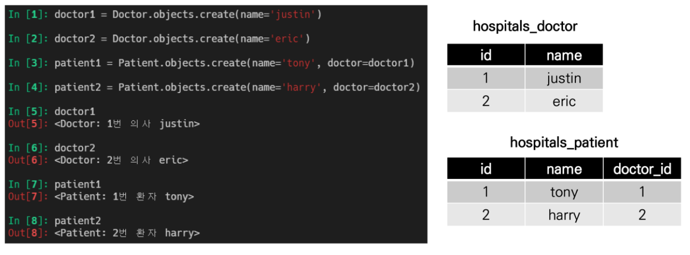
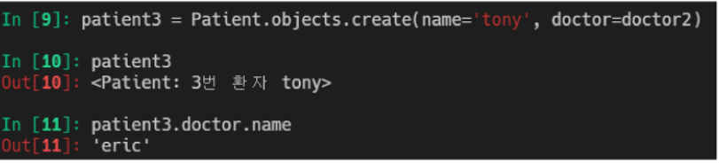

# Model relationship2

- Intro
  - 병원 진료 기록 시스템
- ManyToManyField
  - 좋아요 기능 (like)
  - Profile Page
  - 팔로우 기능 (Follow)

## Intro 병원 진료 기록 시스템

#### 병원 진료 기록 시스템을 통한 M:N 관계 학습

- 환자와 의사가 사용하는 병원 진료 기록 시스템 구축
  - 병원 시스템에서 가장 핵심이 되는 객체는 무엇일까? 환자와 의사
  - 이 둘의 관계를 어떻게 표현할 수 있을까?
- 시작하기 전
  - 모델링은 현실 세계를 최대한 유사하게 반영하기 위한 것
  - 우리 일상에 가까운 예시를 통해 DB를 모델링하고, 그 내부에서 일어나는 데이터의 흐름을 ㅇ어떻게 제어할 수 있을지 고민해보기

#### 1:N의 한계

- 1:N 모델 관계 설정

- 마이그레이션 후 shell_plus 실행

- 의사 2명과 환자 2명 생성
  - 환자는 외래키가 있기 때문에 어떤 의사한테 진료 받을지 등록해야 함

- 1번 환자(tony)가 1번 의사의 진료를 마치고, 2번 의사에게도 방문하려고 한다면, 새로운 예약을 생성해야 한다

- 기존의 예약을 유지한 상태로 새로운 예약을 생성
- 새로 생성한 3번 환자(tony)는 1번 환자(tony)와 다름

- 한 번에 두 의사에게 진료를 받고자 함
- 하나의 외래 키에 2개의 의사 데이터를 넣을 수 없음

- 새로운 예약을 생성하는 것이 불가능
  - 새로운 객체를 생성해야 함
- 여러 의사에게 진료 받은 기록을 환자 한 명에 저장할 수 없음
  - 외래 키에 '1,2' 형식의 데이터를 넣을 수 없음

#### 중개 모델

- 중개 모델(혹은 중개 테이블, Associative Table) 작성

- 데이터베이스 초기화 / 마이그레이션 및 shell_plus 실행
- 중계 모델과의 모델 관계 확인

- 의사 1명과 환자 1명 생성 및 예약 생성
  - 아까는 환자가 자신이 등록되면서 만듬
  - 중개모델 입장에서는 외래키 두개에 대한 객체 필요
  - Reservation (모델 클래스)

- 예약 내역 조회
- 의사의 예약 환자 조회(1->N 역참조)

- 환자의 담당 의사 조회(1->N 역참조)

- 환자 1명 추가 생성 및 1번 의사에게 예약 생성

- 의사의 예약 환자 조회

#### ManyToManyField

- 다대다(M:N, many-to-many) 관계 설정 시 사용하는 모델 필드
- 하나의 필수 위치인자(M:N 관계로 설정할 모델 클래스)가 필요
- ManyToManyField 작성 (중개 모델 삭제)
  - 필드 작성 위치는 Doctor 또는 Patient 모두 작성 가능

- 데이터베이스 초기화/ 마이그레이션 및 shell_plus 실행
- ManyToManyField로 인해 생성된 중개 테이블 확인
- 의사 1명과 환자 2명 생성

- 예약 생성 (참조)
  - patient1(tony)이 doctor1(justin)에게 예약
  - patient1이 예약한 의사 목록 확인
  - doctor1에게 예약된 환자 목록 확인

- 예약 생성(역참조)
  - doctor1(justin)이 patient2(harry)를 예약
  - doctor1에게 예약된 환자 목록 확인
  - patient2, patient1이 각각 예약한 의사 목록 확인

- 중개 테이블 확인

- 예약 삭제 (역참조)
  - add 대신 remove

- 예약 삭제 (참조)

- 중개 테이블 확인
  - 비어 있음

#### related_name

- target model(관계 필드를 가지지 않은 모델)이 source model(관계 필드를 가진 모델)을 참조할 때 사용할 manager의 이름을 설정
  - 역참조
- ForeignKey의 related_name과 동일

- 마이그레이션 및 shell_plus 실행
  - 얘는 지워줄 필요는 없다

#### 중개 모델(테이블) in Django

- Django 는 ManyToManyField를 통해 중개 테이블을 자동으로 생성
- 그렇다면 중개 테이블을 직접 작성하는 경우는 없음?
  - ㄴㄴ 있음. 예약 시간이랑 증상까지 나타내야 할 때(추가적인 필드? 필요할 때)
  - 중개 테이블을 수동으로 지정하려는 경우 through 옵션을 사용하여, 중개 테이블을 나타내는 Django 모델을 지정할 수 있음(뒤에 나옴)
  - 가장 일반적인 용도는 중개 테이블에 추가 데이터를 사용해 다대다 관계로 연결하려는 경우에 사용

#### 요약

- 실제 Doctor와 Patient 테이블이 변하는 것은 없음
- 1:N 관계는 완전한 종속의 관계이지만, M:N 관계는 동등한 관계. 의사에게 진찰받는 환자, 환자를 진찰하는 의사 두가지 형태로 모두 표현이 가능한 것

## ManyToManyField

#### ManyToManyField's 개념 및 특징

- 다대다 (M:N, many-to-many) 관계 설정 시 사용하는 모델 필드
- 하나의 필수 위치인자(M:N 관계로 설정할 모델 클래스)가 필요
- 모델 필드의 RelatedManager를 사용하여 관련 개체를 추가, 제거 또는 만들 수 있음
  - add(), remove(), create(), clear() ...
- RelatedManager
  - 일대다 또는 다대다 관련 컨텍스트에서 사용되는 manager

#### ManyToManyField's Arguments

- related_name
  - target model(관계 필드를 가지지 않은 모델)이 source model(관계 필드를 가진 모델)을 참조할 때(역참조 시) 사용할 manager의 이름을 설정
  - ForeignKey의 related_name과 동일
- through
  - 중개 테이블을 직접 작성하는 경우, through 옵션을 사용하여 중개 테이블을 나타내는 Django 모델을 지정할 수 있음
  - 일반적으로 중개 테이블에 추가 데이터를 사용하는 다대다 관계와 연결하려는 경우(extra data with a many-to-many relationship)에 주로 사용됨
- symmetrical
  - ManyToManyField가 동일한 모델(on self)을 가리키는 정의에서만 사용
  - symmetrical=True(기본값)일 경우 Django는 person_set 매니저를 추가하지 않음
  - source 모델의 인스턴스가 target 모델의 인스턴스를 참조하면, target 모델 인스턴스도 source 모델 인스턴스를 자동으로 참조하도록 함
    - 즉, 내가 당신의 친구라면 당신도 내 친구가 되는 것
    - 대칭을 원하지 않는 경우 False로 설정
    - Follow 기능 구현에서 다시 확인할 것!

#### Related Manager

- 1:N 또는 M:N 관련 컨텍스트에서 사용되는 매니저
- 같은 이름의 메서드여도 각 관계(1:N, M:N)에 따라 다르게 사용 및 동작
  - 1:N 에서는 target 모델 인스턴스만 사용 가능
  - M:N 관계에서는 관련된 두 객체에서 모두 사용 가능

- 메서드 종류
  - add(), remove(), create(), clear(), set() 등

- add()
  - 지정된 객체를 관련 객체 집합에 추가
  - 이미 존재하는 관계에 사용되면 관계가 복제되지 않음 ex. 1-1 하고 또 1-1 안됨
  - 모델 인스턴스, 필드 값(PK)을 인자로 허용

- remove()
  - 관련 객체 집합에서 지정된 모델 객체를 제거
  - 내부적으로 QuerySet.delete()를 사용하여 관계가 삭제됨
  - 모델 인스턴스, 필드 값(PK)을 인자로 허용

#### through 예시

- 모델 관계 설정

- 데이터베이스 초기화 / 마이그레이션 shell_plus 실행
- 중개 테이블 확인 (doctor와 patient에는 변화 없음)

- 의사 1명과 환자 2명 생성

- 예약 생성 - 1 (Reservation)

- 중개 테이블 확인

- 예약 생성 - 2 (Patient)
  - through_defaults 딕셔너리 이용해 작성

- 중개 테이블 확인

- 예약 삭제

#### 데이터베이스에서의 표현

- Django는 다대다 관계를 나타내는 중개 테이블을 만듦
- 테이블 이름은 <u>다다대 필드의 이름</u>과 <u>이를 포함하는 테이블 이름</u>을 조합하여 생성됨

#### 중개 테이블의 필드 생성 규칙

- source model 및 target model 모델이 다른 경우
  - id
  - <containing_model>_id
  - <other_model>_id
- ManyToManyField가 동일한 모델을 가리키는 경우
  - id
  - `from_<model>_id`
  - `to_<model>_id`

-----------------

## Like

#### Like 구현

- ManyToManyField 작성 후 마이그레이션
  - Article에 쓰든 User에 쓰든 노상관. Article에 많이 썼어서 여기 씀

- 에러 발생 원인
  - like_users 필드 생성 시 자동으로 역참조는 .article_set 매니저를 생성
  - 그러나 이전 1:N(User:Article) 관계에서 이미 해당 매니저 이름 사용 중 (user.article_set)
  - User와 관계된 ForeignKey 또는 ManyToManyField 중 하나에 related_name 추가 필요
    - 보통 MTMField 바꿈. 이름 직관적.

- related_name 설정 후 마이그레이션 다시 진행

- 생성된 중개 테이블 확인

#### 현재 User - Article 간 사용 가능한 DB API

- article.user
  - 게시글을 작성한 유저 - 1:N
- article.like_users
  - 게시글을 좋아요한 유저 - M:N
- user.article_set
  - 유저가 작성한 게시글 (역참조) - 1:N
- user.like_articles
  - 유저가 좋아요한 게시글 (역참조) - M:N

#### 다시 Like 구현

- url 작성

- like view 함수 작성

#### QuerySet API - exists()

- QuerySet에 결과가 포함되어 있으면 True를 반환하고 그렇지 않으면 False를 반환
- 특히 규모가 큰 QuerySet의 컨텍스트에서 특정 개체 존재 여부와 관련된 검색에 유용
  - request.user in article.like_users.all() 의 in 보다 효율적
- 고유한 필드(예: primary key)가 있는 모델이 QuerySet의 구성원인지 여부를 찾는 가장 효율적인 방법

#### 다시 Like 구현

- create.html에서 {{ form.as_p }} 로 form을 가져오기 때문에

- like_users가 출력이 된다

- articles/forms.py에서 exclude에 like_users 추가해주기

- index 페이지에 like 출력 부분 작성

- 좋아요 버튼 클릭 후 테이블 확인

## Profile Page

#### Profile Page 작성

- 자연스러운 follow 흐름을 위한 회원 프로필 페이지 작성하기
- url 작성

- profile view 함수 작성
  - username pk 아닌데 ㄱㅊ? ㅇㅇ username 내부적으로 unique 조건 있음

아니면 좀 더 직관적으로

- profile 페이지 작성

- base 페이지에 프로픨 링크 작성

- index 페이지에 게시글 작성자 프로필 링크 작성

## Follow

#### Follow 구현

- ManyToManyField 작성 후 마이그레이션

- 생성된 중개 테이블 확인

- url 작성

- follow view 함수 작성

아니면 직관적으로

​	- user: 프로필 주인(by get_user_model()), request.user: 로그인한 유저(나) 

- profile 페이지에 팔로우와 언팔로우 버튼 작성
  - 팔로잉 수 / 팔로워 수 출력
  - 자기 자신을 팔로우 할 수 없음

혹은 with 태그 이용

- 팔로우 버튼 클릭 후 테이블 확인

