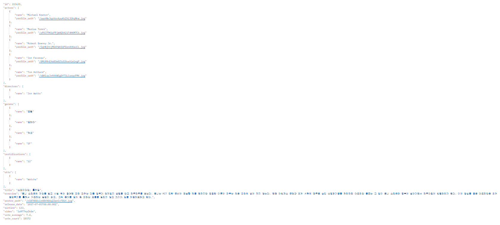

# 0521

- dummy data 코드 완성
- models.py 확정
- erd 작성 완료
- 레이아웃
  - 메인 페이지
  - recommend
- Gitlab에 django 프로젝트 생성


## dummy data 코드 & model 변경

- mtm field 데이터 생성을 위해 모델의 mtm field 위치 변경
- 


## Gitlab django 프로젝트 생성

**django_back 프로젝트 생성**

- final-pjt-back 폴더 안에 django_back 프로젝트 생성

- requirements.txt 새로 생성 (필요할 때마다 추가)

  ```txt
  asgiref==3.5.0
  Django==3.2.12
  pytz==2022.1
  sqlparse==0.4.2
  ```

- accounts, community, movies 앱 생성 후 등록

- settngs.py에 AUTH_USER_MODEL = 'accounts.User' 작성


**에러**

- .gitignore 빠뜨렸더니 CRLF 에러 떴다.


우리가 원하는 데이터만 넣기

movie id로 채우는거


- 중복 문제 해결

pk를 기존 movie에서 받아온 pk와 동일하게 하여 중복값이 있으면 안 들어가게.


# 0523

- Movie Serializer
- accounts
- community


## Movie Serializer

**urls.py**

```python
from django.contrib import admin
from django.urls import path, include

urlpatterns = [
    path('admin/', admin.site.urls),
    path('movies/', include('movies.urls')),
]
```


**Movies/urls.py**

```python
from django.urls import path
from . import views

app_name ='movies'
urlpatterns = [
    path('', views.index, name='index'),
    path('movie/<int:movie_pk>/', views.movie_detail, name='movie_detail'),
    path('recommend/otts/<int:ott_id>/', views.recommend_otts, name='recommend_otts'),
    path('recommend/directors/<int:director_id>/', views.recommend_directors, name='recommend_directors'),
    path('recommend/keywords/<int:keyword_id>/', views.recommend_keywords, name='recommend_keywords'),
]
```

- 레이아웃의 /recommend 페이지는 


```python
# 로직 설명

keyword_list = ['2343', '9840', '180547', '18035']
keyword = random.choice(keyword_list)
movies = Movie.objects.filter(keywords=keyword).order_by('?')[:10]
```


- index


수연언니를 속인 날..

orgin 오타 ㄷㄷ

Serializer 작성 중

serializers

변수명이 아니라 related_name 넣어줘야 한다!!!

- movie




- recommend_detail는 View임

- 고난 url 뒤에 슬래시
- 404는 vue에서


## Account

cors header(리드미보고 다시 정리)

login, logout, signup

is_staff 관리자 권한 시도해볼 것


read_only = True


article view 함수 바꿔줬다

500Internal Server Error 였다.


## Vue.js

django settings.py local 8081 추가


vue create 


vue add router

vue add vuex

vue add axios 


api/drf.js


store/index.js로 데이터 잘 출력되는지 보기


App.vue 에서 출력

- movies.movie()
  - article이 비어있어서 생긴 문제
- login 안되서 생긴 문제 같아서 login 시켜줌
- login 넣고나서 app도 안뜸
  - why?

- movielistview - css 
- 


# 0524

## Vue.js

```bash
$ vue add router
$ vue add vuex
$ npm i axios
$ npm i lodash
$ npm install vue boostrap-vue bootstrap
```

- bootstrap main.js에 추가

```txt
순서
View 생성
router에 path 등록
Navbar.vue에 넣어주기
drf.js
store
View 페이지 만들기
```


**Accounts**

- LoginView
- LogoutView 
- SignupView 
- 장고랑 연동 완료
  - LoginView SignupView 에 auther-or-list 주석 처리. 아직 안 함.


**Movies**

- movielistView 
- 장고랑 연동 완료
  - store/movies.js에 authheader써야 값이 보인다. 
  - 로그인 시에만 출력 가능. 아닐때도 보여주는 방법 무엇?


**Community**

- ArticleListView
- ArticleNewView
- ArticleFormComponent 
- 장고랑 연동 완료
  - 관리자 아닐 시 글 안 써지는 것 확인함!


**확인할 것**

- Route with name 'articles' does not exist 어딘가에 사용 안 된 view router가 적혀있다. 일단 무시~
- movies.js에 lodash 일단 주석처리함


## 할 일

- keyword: sea, dream(dummy)
- ~~urls.py api/v1~~
- is_staff or auth_permissions 커뮤니티에 기사 내용 관리자와 기자 기능 
  - admin에서 status 바꿔줌
  - vue에서는 버튼 보이고 안보이게해줘야함

- 로그인 시 home, recommend, 보여주고 안 보여주는 거 정할 것

- 할수있는일)이상한 데이터가 올라와있으면 admin에서 삭제할 것

- admin 등록